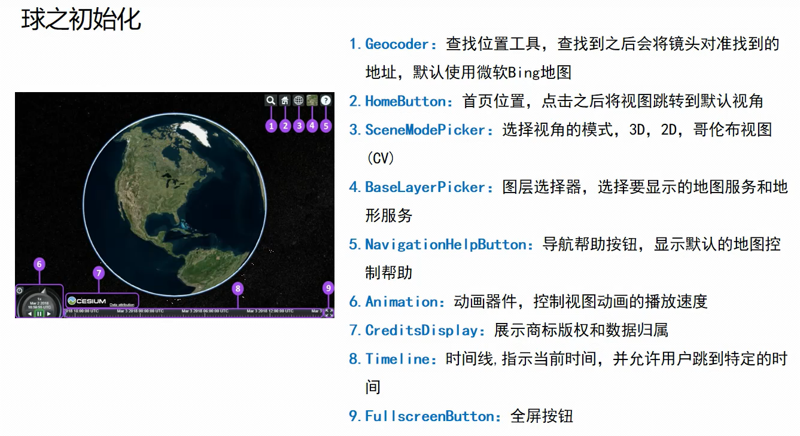

# 1.加载默认地图

```
    <!DOCTYPE html>
    <html lang="en">
    <head>
        <meta charset="UTF-8">
        <title>Title</title>
        <script type="text/javascript" src="./Cesium/Cesium.js"></script>
        <style>
            @import url('./Cesium/Widgets/widgets.css');
            *{box-sizing: border-box;}
            body{
                display: flex;
                justify-content: center;
                align-items: center;
            }
            #cesiumContainer{
                height: 70vh;
                width: 50vw;
            }
        </style>
    </head>
    <body>
    <div id="cesiumContainer">
    </div>
    <script>
        var token='账号token';
        Cesium.Ion.defaultAccessToken=token;
        const viewer = new Cesium.Viewer("cesiumContainer");
    </script>
    </body>
    </html>
```

可通过图片上的语法控制控件是否显示在UI界面上

# 2.加载不显示各种控件的地图

(1)方法一

下面图片上有各种小组件，下面代码可使其不显示



```
<!DOCTYPE html>
<html lang="en">
<head>
    <meta charset="UTF-8">
    <title>Title</title>
    <script type="text/javascript" src="./Cesium/Cesium.js"></script>
    <style>
        @import url('./Cesium/Widgets/widgets.css');
        *{box-sizing: border-box;}
        body{
            display: flex;
            justify-content: center;
            align-items: center;
        }
        #cesiumContainer{
            height: 70vh;
            width: 50vw;
            }
    </style>
</head>
<body>
<div id="cesiumContainer"></div>
<script>
    var token='账号token';
    Cesium.Ion.defaultAccessToken=token;
    const viewer = new Cesium.Viewer("cesiumContainer",{
        animation:false,//6
        timeline:false,//8
        geocoder:false,//1
        homeButton:false,//2
        sceneModePicker:false,//3
        baseLayerPicker:false,//4
        navigationHelpButton:false,//5
        fullscreenButton:false,//9
        infoBox:false,//信息框
        navigationInstructionsInitiallyVisible:false,
        selectionIndicator:false,//是否选取指示器组件
        vrButton:false,//VR模式
    });
    viewer._cesiumWidget._creditContainer.style.display="none";//7
</script>
</body>
</html>
```

(2)方法二

```
<!DOCTYPE html>
<html lang="en">
<head>
    <meta charset="UTF-8">
    <title>Title</title>
    <script type="text/javascript" src="./Cesium/Cesium.js"></script>
    <style>
        @import url('./Cesium/Widgets/widgets.css');
        *{box-sizing: border-box;}
        body{
            display: flex;
            justify-content: center;
            align-items: center;
        }
        #cesiumContainer{
            height: 70vh;
            width: 50vw;
        }
        /* 隐藏cesium的图标及版权信息 */
        .cesium-widget-credits {
            display: none !important;
            visibility: hidden !important;
        }
    </style>
</head>
<body>
<div id="cesiumContainer"></div>
<script>
    var token='账号token';
    Cesium.Ion.defaultAccessToken=token;
    const viewer = new Cesium.CesiumWidget("cesiumContainer");
</script>
</body>
</html>
```

# 3.加载其他来源的地图

(1)Argis地图

```
<!DOCTYPE html>
<html lang="en">

<head>
    <meta charset="UTF-8">
    <title>Title</title>
    <script type="text/javascript" src="./Cesium/Cesium.js"></script>
    <!-- 在此引入其他来源的JS文件 -->
    <style>
        @import url('./Cesium/Widgets/widgets.css');
        * {
            box-sizing: border-box;
        }
        body {
            display: flex;
            justify-content: center;
            align-items: center;
        }
        #cesiumContainer {
            height: 70vh;
            width: 50vw;
        }
        /* 隐藏cesium的图标及版权信息 */
        .cesium-widget-credits {
            display: none !important;
            visibility: hidden !important;
        }
    </style>
</head>
<body>
    <div id="cesiumContainer"></div>
    <script>
        var token = '账号token';
        Cesium.Ion.defaultAccessToken = token;
        const viewer = new Cesium.CesiumWidget("cesiumContainer");
        viewer.imageryLayers.get(0).show = false;//不使用cesium自带的默认底图
        //替换地图来源
        var img_arcgis=new Cesium.ArcGisMapServerImageryProvider({
            name:"img_arcgis",
            url:"https://services.arcgisonline.com/ArcGIS/rest/services/World_Imagery/MapServer"
        });
        var layers= viewer.scene.imageryLayers;
        layers.addImageryProvider(img_arcgis);
        //替换到此结束
    </script>
</body>
</html>
```

下面其他的地图就不放源码了，只放中间一部分，替换掉就行

(2)百度地图(需要引入百度JS文件)

```
    var img_baidu=new BaiDuImageryProvider({
        layer:"vec"
    });
    var layers= viewer.scene.imageryLayers;
    layers.addImageryProvider(img_baidu);
```

(3)高德影像

```
   var layers= viewer.scene.imageryLayers;
    layers.addImageryProvider(new Cesium.UrlTemplateImageryProvider({
        url:"http://webst02.is.autonavi.com/appmaptile?style=6&x={x}&y={y}&z={z}"
    }));
```

(4)高德矢量

```
    var layers= viewer.scene.imageryLayers;
    layers.addImageryProvider(new Cesium.UrlTemplateImageryProvider({
        url:"http://webst02.is.autonavi.com/appmaptile?style=7&x={x}&y={y}&z={z}"
    }));
```

其他方法请[点我](http://syzdev.cn/cesium-docs/guide/ImageryProvider-example.html#gridimageryprovider)

# 4.场景渲染

```
    viewer.scene.skyBox.show = false // 隐藏星空
    viewer.scene.skyAtmosphere.show = false  // 隐藏大气层
    viewer.scene.globe.show = false  // 隐藏地球
    viewer.scene.sun.show = false  // 隐藏太阳
    viewer.scene.moon.show = false // 隐藏月亮

```
# 5.添加图层

```
    //方法1.这种方法添加影像图层只能添加一个
    const viewer = new Cesium.Viewer("cesiumContainer", {
        imageryProvider: new Cesium.ArcGisMapServerImageryProvider({
            url: 'https://services.arcgisonline.com/ArcGIS/rest/services/World_Imagery/MapServer'
    })
})
```

```
    //方法2
    const ArcGisImagery = viewer.imageryLayers.addImageryProvider(new Cesium.   ArcGisMapServerImageryProvider({
    url: 'https://services.arcgisonline.com/ArcGIS/rest/services/World_Imagery/   MapServer'
    }))
```
# 6.修改影像的属性

```
    // 修改第一个影像的透明度、明亮度和对比度
    viewer.imageryLayers._layers[0].alpha = 0.5
    viewer.imageryLayers._layers[0].brightness = 2
    viewer.imageryLayers._layers[0].contrast = 3    
```
# 7.为地图添加标注

(1)添加高德标注

```
    viewer.imageryLayers.addImageryProvider(new Cesium.UrlTemplateImageryProvider({
        url: "http://webst02.is.autonavi.com/appmaptile?x={x}&y={y}&z={z}&lang=zh_cn&size=1&scale=1&style=8",
    }))
```
(2)添加天地图标注

```
    const tdtToekn = '账号token'
    viewer.imageryLayers.addImageryProvider(new Cesium.WebMapTileServiceImageryProvider({
        url: `http://t0.tianditu.com/cva_w/wmts?service=wmts&request=GetTile&version=1.0.0&LAYER=cva&tileMatrixSet=w&TileMatrix={TileMatrix}&TileRow={TileRow}&TileCol={TileCol}&style=default&format=tiles&tk=${tdtToekn}`,
        layer: "tdtAnnoLayer",
        style: "default",
        format: "image/jpeg",
        tileMatrixSetID: "GoogleMapsCompatible",
    }))
```
# 8.添加地形

```
    //方法一
    const viewer = new Cesium.Viewer("cesiumContainer", {
        terrainProvider: new Cesium.ArcGISTiledElevationTerrainProvider({
            url: 'https://elevation3d.arcgis.com/arcgis/rest/services/WorldElevation3D/Terrain3D/ImageServer',
        })
    })
```

```
    const viewer = new Cesium.Viewer("cesiumContainer")
    const ArcGisTerrainProvider = new Cesium.ArcGISTiledElevationTerrainProvider({
        url: 'https://elevation3d.arcgis.com/arcgis/rest/services/WorldElevation3D/Terrain3D/ImageServer',
    })
    viewer.terrainProvider = ArcGisTerrainProvider
```

地形提供示例：[点我](http://syzdev.cn/cesium-docs/guide/terrainProvider-example.html#arcgistiledelevationterrainprovider)

# 9.为海面添加流动效果

```
    const viewer = new Cesium.Viewer("cesiumContainer")
    const terrainProvider = Cesium.createWorldTerrain({
        requestWaterMask: true, // 请求水体效果所需要的海岸线数据
    })
    viewer.terrainProvider = terrainProvider
```

# 10.添加等高线

```
    function contourLine(width, spacing, color) {
        let material = Cesium.Material.fromType("ElevationContour")
        material.uniforms.width = width
        material.uniforms.spacing = spacing
        material.uniforms.color = color
        viewer.scene.globe.material = material
    }
    // 等高线的线宽为2px，高度间隔为100m，颜色为红色
    contourLine(2.0, 100, Cesium.Color.RED)
```

